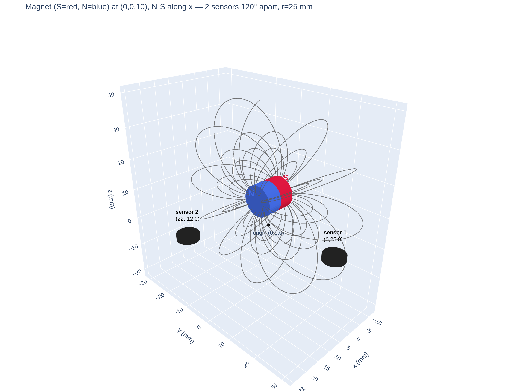

# Measuring 3 rotation angles with a magnet and two magnetic sensors

A ball joint: a small magnet is fixed near the pivot, and two 3-axis magnetic
sensors ride on the shell that rotates around it. Goal: read the shell's three
rotation angles — **yaw, pitch, roll** — from the sensor values alone. No
encoder, no contact.

Everything here is verified in simulation (no hardware needed). Fields are
computed with [magpylib](https://magpylib.readthedocs.io) (exact analytic field
of a cylinder magnet); the inverse solve uses `scipy.optimize.least_squares`.



## The setup (matches the physical rig)

| Part | Details |
|---|---|
| Magnet | two NdFeB discs (10 mm dia × 5 mm, N35) stacked pole-to-pole → one 10 mm-thick cylinder, ~1.2 T. Its **N–S line points along +x** (the roll axis). |
| Position | raised to **(0, 0, 10) mm** — off the pivot center. This offset is what makes roll observable (see below). |
| Sensors | 2 × Infineon TLV493D (±130 mT range, ~0.1 mT noise/axis), on a ring of **radius 25 mm** in the z = 0 plane, **120° apart** in azimuth. |
| Pivot | at the origin (0,0,0). The magnet is fixed; the two sensors ride the shell and rotate about the pivot. |
| Workspace | yaw ±120° (about z), pitch ±25° (about y), roll ±25° (about x). |

Across the whole workspace the per-sensor field stays between **2.5 and 15 mT** —
strong enough for sub-degree signal, far inside the TLV493D's ±130 mT range.

**Why roll is observable.** A magnet's field is perfectly round about its own
N–S line. If the magnet sat exactly at the pivot, rolling the shell about that
line would carry the sensors through identical field and roll would be invisible.
Raising the magnet to (0,0,10) moves its symmetry line off the pivot, so no
rotation leaves the field unchanged — roll becomes readable. Two sensors 120°
apart (seeing complementary parts of the field) remove ambiguous "look-alike"
poses; a single sensor's 3 numbers for 3 unknowns leaves no margin.

## How it works — three pieces

```
simulation.py          geometry + forward model + the 3D view above
build_lookup_table.py  sweep the workspace → lookup_table.npz
estimation.py          load the table → nearest guess → least_squares
```

**1. Forward model — `simulation.py`.**
`predict_readings(yaw, pitch, roll)` returns the 6 numbers the two chips would
report at that pose: the shell carries each sensor to `rotation.apply(home)`, the
magnet's field there is computed, then rotated back into the chip's own frame.

**2. Lookup table — `build_lookup_table.py`.**
Sweeps a grid (yaw −120…120 step 10°, pitch & roll ±25 step 5° → **3,025 poses**)
and stores each pose's 6 readings in `lookup_table.npz`. Rebuild any time the
geometry changes.

**3. Estimator — `estimation.py`.**
`estimate(measured, seed=None)` inverts the model in two stages:
- *stage 1:* compare the measurement against the table, take the 3 closest poses
  as starting guesses (3, not 1, to dodge look-alike regions);
- *stage 2:* `least_squares` fine-tunes each guess against `predict_readings`
  until predicted = measured; the best fit wins.

In a tracking loop, pass the previous frame's answer as `seed` to skip the table.

## Accuracy (simulation, 0.1 mT noise, whole workspace)

| axis | median | 95th percentile |
|---|---|---|
| yaw | 0.51° | 1.69° |
| pitch | 0.43° | 1.41° |
| roll | 0.64° | 2.04° |
| **worst of the three** | **1.00°** | **2.22°** (worst seen ≈ 3.6°) |

No look-alikes anywhere (0 of 500 random poses missed). ~58 ms per cold-start
estimate in plain Python; far faster in tracking mode (`seed=` skips the lookup).
Roll is the weakest axis, as expected — it rides on the off-center offset alone.

## Run it

```bash
python -m venv .venv
.venv/bin/pip install numpy scipy magpylib plotly kaleido
.venv/bin/python simulation.py            # opens/saves the 3D setup view
.venv/bin/python build_lookup_table.py    # writes lookup_table.npz
.venv/bin/python estimation.py            # noise-in / accuracy-out demo
```

`estimation.py` auto-builds the table if `lookup_table.npz` is missing.

## Scripts

| File | Role |
|---|---|
| `simulation.py` | hardware geometry, forward field model, 3D visualization |
| `build_lookup_table.py` | builds `lookup_table.npz` from the forward model |
| `estimation.py` | inverse solve: 6 readings → (yaw, pitch, roll) |
| `lookup_table.npz` | generated (3,025 poses × 6 readings); git-ignored |

## Limitations & from simulation to a real device

- **Accuracy scales with sensor noise.** 0.1 mT → ~1° worst-axis median.
  Averaging N samples improves it by √N (e.g. 4 samples ≈ halve the error).
- The simulation assumes a perfect magnet, exact placement, no temperature drift,
  and no iron nearby.
- **Calibrate instead of trusting the drawing.** Mounting errors are unavoidable;
  absorb them by fitting the model to reality — collect readings at ~50–100 known
  poses, fit the physical parameters (magnet position/orientation/strength, each
  sensor's position/orientation/zero-offset) with the same `least_squares`
  machinery, then rebuild the table. The estimator code does not change.
- **Sensor practicalities.** Two TLV493D on one I²C bus need their two addresses
  set at power-up; average 4–8 samples per reading; calibrate and operate at
  similar temperature. Build with non-magnetic hardware (brass/plastic) near the
  shell.
