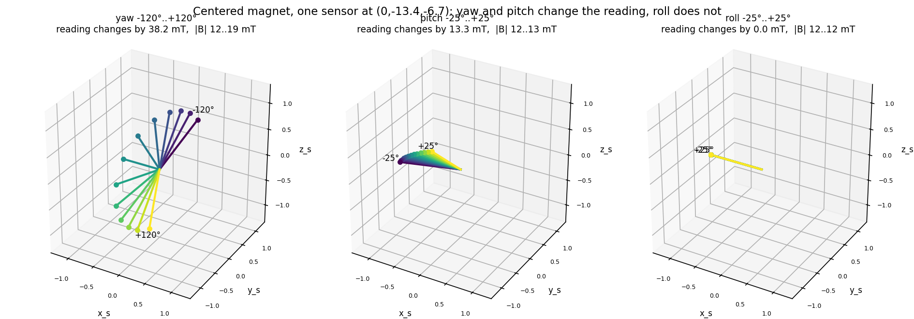
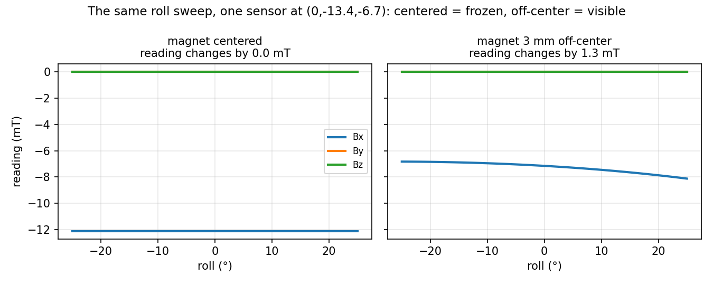
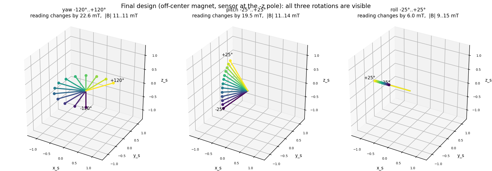

# Measuring 3 rotation angles with a magnet and magnetic sensors

A ball joint: a small magnet is fixed at the pivot center, and 3-axis magnetic
sensors ride on the shell that rotates around it. Goal: read the shell's three
rotation angles — yaw, pitch, roll — from the sensor values alone. No encoder,
no contact.

## Hardware

| Part | Details |
|---|---|
| Magnet | disc 3 mm dia × 2 mm, axially magnetized NdFeB (N on a flat face, ~1.2 T) |
| Sensors | 2 × Infineon TLV493D, 3-axis, ~0.1 mT noise per axis |
| Geometry | magnet at the pivot center, N–S line along x; sensors on the shell, 2.24 mm from the pivot |
| Workspace | yaw ±120° (about z), pitch ±25° (about y), roll ±25° (about x = the N–S line) |

## How everything is verified

No hardware is needed for this study. Fields are computed with
[magpylib](https://magpylib.readthedocs.io) (exact analytic field of a cylinder
magnet), 3D views with [Plotly](https://plotly.com/python/), sensor noise
simulated at 0.1 mT. Every claim below names the script that demonstrates it.

```bash
python -m venv .venv
.venv/bin/pip install numpy scipy magpylib plotly
.venv/bin/python <script>.py
```

## Q1 — Can 1 magnet + 1 sensor measure all three rotations?

**No. Roll is invisible — provably, not just in practice.**
The magnet's field is perfectly round about its own N–S line. Rolling the
shell about that line carries every sensor through identical field, so no
reading changes. This is exact (machine precision) and independent of how many
sensors are used: the information simply is not in the field.

*Experiment:* `estimate_yaw_pitch.py` part 1 sweeps roll and prints the frozen
reading.


*The sensor's reading vector (in its own frame) while one angle sweeps and the
others stay at zero. Yaw (left) and pitch (middle) fan the vector out — lots of
signal. Roll (right): all arrows lie exactly on top of each other; the reading
changes by 0.0 mT over the whole ±25° sweep.*

## Q2 — Can it still measure yaw and pitch?

**Yes.** Yaw and pitch move the sensor to places where the field is different,
so the reading changes and the two angles can be recovered from a single
sensor's 3 numbers — for any roll, since roll has no effect on them.
Accuracy in simulation: ~0.1° typical, ~0.4° worst (0.1 mT noise).

*Experiment:* `estimate_yaw_pitch.py` part 2. A 3D view of the reading
changing along a yaw sweep: `magnet_sensor.py`.

## Q3 — What does it take to measure all three?

Two changes, each fixing a different problem:

**1. Mount the magnet off-center** (0.5 mm, perpendicular to the N–S line).
The field is round about the line through the magnet's *center* along N–S;
shifting the magnet moves that line away from the pivot, so no rotation about
any pivot axis leaves the field unchanged — roll becomes visible.
Dead ends we tested on the way: *tilting* a centered magnet does not help (the
symmetry line tilts along and still passes through the pivot), and *two
magnets* do not beat one (they split the limited space, and two crossed
dipoles at one point merge into a single tilted dipole — still round).


*The proof of the off-center trick: the same ±25° roll sweep, same sensor.
Centered magnet (left): every reading component is a flat line — zero
information. Magnet shifted 0.5 mm (right): the reading now changes by
13.4 mT across the sweep — 134× the sensor noise, plenty to decode roll.*

**2. Use two sensors.** One sensor gives 3 numbers for 3 unknowns — zero
margin. It has weak poses (some angle combination barely changes the reading)
and "look-alike" pose pairs with identical readings. The second sensor's weak
poses fall elsewhere, and 6 numbers for 3 unknowns remove the look-alikes.

How the solution was derived: a symmetry argument for the offset, plus a
sensitivity metric for the rest — at every pose, the signal (mT per degree) in
the *quietest* combination of the three angles; expected error ≈ noise /
sensitivity; a design is judged by its worst pose. A placement-optimization
study against that metric put the two sensors at the shell's **+z and −z
poles** (worst case 1.66 mT/° → 0.06° over the whole workspace) and confirmed
the magnet itself is already at its size/offset limit.

## Q4 — The final solution, and how well it works

`estimate_yaw_pitch_roll.py` — off-center magnet, sensors at the ±z poles:

- `predict_readings(yaw, pitch, roll)` — forward model: angles → the 6 numbers.
- A lookup table (3,025 poses, built once) turns a measurement into a rough
  starting guess; `least_squares` fine-tunes it until predicted = measured.
- Pass the previous frame's answer as `seed` to skip the table (tracking mode).


*The final geometry (off-center magnet, sensor at the shell's −z pole): now
every rotation produces a strong change — yaw fans the vector 120°, pitch 83°,
and roll changes the reading by ~59 mT (it stretches the vector rather than
turning it, which is why the arrows overlap; the |B| range in the title shows
the change). No angle is silent anymore.*

Verified in simulation, 0.1 mT noise, whole workspace:

| Test | Result |
|---|---|
| no noise, random poses | exact (0.000°) — no look-alikes anywhere |
| random poses with noise | ~0.03° median, <0.1° worst |
| workspace corners, weak-band poses | same as everywhere else |
| tracking a smooth motion | ~11 ms per estimate (plain Python) |

## Limitations

- **Accuracy is proportional to sensor noise**: 0.1 mT → ~0.06°; 0.5 mT → ~0.3°.
  Averaging N samples improves it by √N.
- **Field strength exceeds the TLV493D range**: peaks at ~240 mT in this
  workspace vs ±130 mT linear range. Before building: weaker magnet, larger
  shell, or a higher-range sensor.
- The simulation assumes a perfect magnet, exact placements, no temperature
  drift, and no iron nearby. Reality differs — see below.
- Possible upgrade, studied but not adopted: a *diametrally* magnetized disc
  (as in commercial rotary encoders) scored ~45% better in an exploratory
  study and gives a more even field; re-evaluate with the real workspace.

## From simulation to a real device

1. **Build** with non-magnetic materials near the shell (brass/plastic screws).
2. **Calibrate instead of trusting the drawing.** Mounting errors are
   unavoidable; absorb them by fitting the model to reality: collect readings
   at ~50–100 known poses (a simple jig with repeatable stops is enough), then
   fit the ~25 physical parameters (magnet position/orientation/strength, each
   sensor's position/orientation/zero-offset) with the same `least_squares`
   machinery. Rebuild the lookup table from the fitted model — the estimator
   code does not change. The leftover mismatch after fitting is a built-in
   health check: if it stays well above sensor noise, something unmodeled is
   present (e.g. a steel screw), or the field model needs extra terms.
3. **Sensor practicalities**: check saturation first (see Limitations); two
   TLV493D on one I²C bus need their two addresses set at power-up; average
   4–8 samples per reading; calibrate and operate at similar temperature, or
   let the estimator track a slow field-scale drift.
4. **Runtime**: call `estimate(reading, seed=previous_answer)` — tracking mode
   is fast and inherently smooth.

## Scripts

| Script | Shows |
|---|---|
| `magnet_sensor.py` | reading vs yaw sweep (sensor frame, interactive 3D view) |
| `estimate_yaw_pitch.py` | Q1 + Q2: roll invisible, yaw & pitch recovered (1 sensor) |
| `estimate_yaw_pitch_roll.py` | Q4: the final estimator, with demo |
| `make_figures.py` | regenerates the figures in `figures/` |
